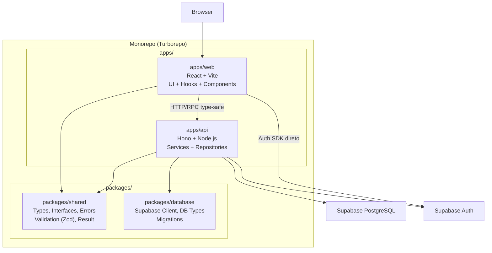
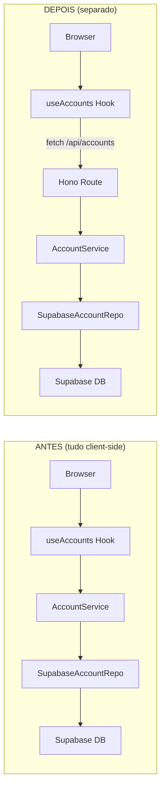
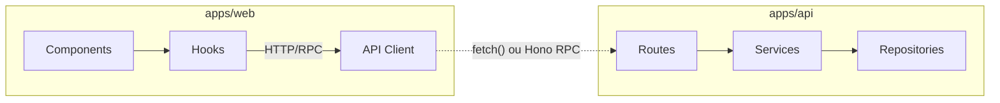
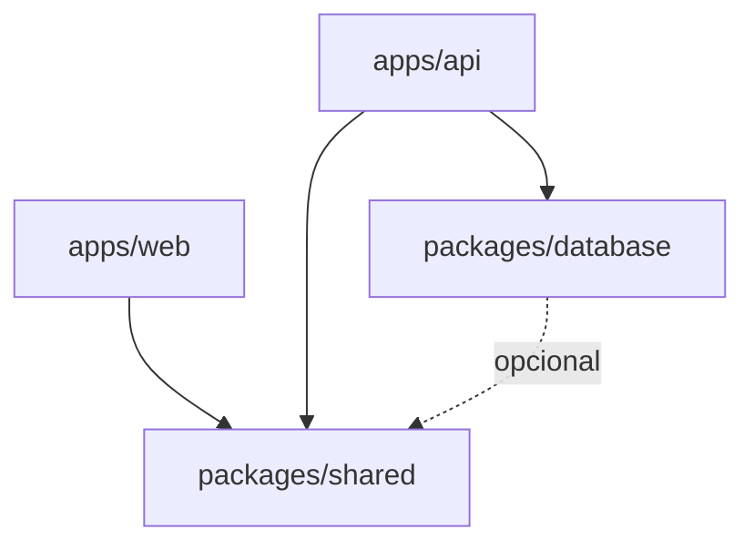

# Migração para Monorepo — Arquitetura Desacoplada

> **Referência**: [ARCHITECTURE_ANALYSIS.md](../architecture/ARCHITECTURE_ANALYSIS.md) | [IMPLEMENTATION_PLAN.md](./IMPLEMENTATION_PLAN.md)  
> **Data**: 18/02/2026  
> **Objetivo**: Migrar o SPA monolítico para monorepo Turborepo com frontend, backend API e pacotes compartilhados.

## Fases do Plano

| # | Fase | Status |
|:---|:---|:---|
| 0 | Setup monorepo (Turborepo + npm workspaces + tsconfig.base.json) | Concluído |
| 1 | Extrair packages/shared (types, errors, interfaces, validation) | Concluído |
| 2 | Extrair packages/database (Supabase client factory) | Concluído |
| 3 | Mover frontend para apps/web (componentes, pages, hooks) | Concluído |
| 4 | Criar apps/api com Hono (services, repositories, routes, middleware) | Concluído |
| 5 | Conectar frontend ao API (API client, remover Supabase direto) | Concluído |
| 6 | Docker e deploy (Dockerfiles, docker-compose, env vars) | Concluído |
| 7 | Testes e CI (migrar testes, atualizar pipeline) | Concluído |

---

## Por que separar?

**Problema atual**: toda a lógica de negócio (services, validação, regras) roda no NAVEGADOR. O Supabase client expõe a `anon_key` no bundle JS. As RLS policies protegem dados, mas não impõem regras de negócio.

**Riscos concretos**:

- Um usuário pode chamar `supabase.from('transactions').insert(...)` diretamente pelo console do browser
- Validações Zod rodam client-side e podem ser contornadas
- Não há como adicionar cron jobs, webhooks ou integrações server-side

## Arquitetura Proposta



## Estrutura de Diretórios Final

```
bandeira.finance.app/
├── apps/
│   ├── web/                        # Frontend React (atual src/ simplificado)
│   │   ├── src/
│   │   │   ├── app/                # Providers (QueryProvider, AuthProvider)
│   │   │   ├── components/         # UI components
│   │   │   ├── features/           # Hooks + componentes por feature
│   │   │   ├── layouts/
│   │   │   ├── pages/
│   │   │   └── lib/                # API client (chama o backend)
│   │   ├── index.html
│   │   ├── vite.config.ts
│   │   ├── tsconfig.json
│   │   ├── tailwind.config.js
│   │   └── package.json
│   │
│   └── api/                        # Backend API
│       ├── src/
│       │   ├── routes/             # Endpoints (accounts, transactions, etc.)
│       │   ├── middleware/         # Auth, error handling, CORS
│       │   ├── services/           # Mesmos services, agora server-side
│       │   ├── repositories/       # Mesmos Supabase*Repository
│       │   ├── di/                 # Bootstrap server-side
│       │   └── index.ts            # Entry point Hono
│       ├── tsconfig.json
│       ├── Dockerfile
│       └── package.json
│
├── packages/
│   ├── shared/                     # Codigo compartilhado (ja existe em core/)
│   │   ├── src/
│   │   │   ├── types/             # Result, auth.types, models, database.types
│   │   │   ├── errors/            # AppError, ValidationError, etc.
│   │   │   ├── interfaces/        # IAuthService, I*Repository
│   │   │   └── validation/        # Zod schemas
│   │   ├── tsconfig.json
│   │   └── package.json
│   │
│   └── database/                   # Configuração Supabase
│       ├── src/
│       │   ├── client.ts           # createClient helper
│       │   └── types.ts            # Re-export database.types
│       ├── migrations/             # SQL migrations (atual supabase/migrations/)
│       ├── tsconfig.json
│       └── package.json
│
├── docker-compose.yml              # Orquestra web + api
├── turbo.json                      # Config Turborepo
├── package.json                    # Root workspace
├── tsconfig.base.json              # Config TS compartilhada
└── docs/                           # Mantém como está
```

## Stack Escolhida e Justificativas

| Ferramenta | Por que |
|:---|:---|
| **Turborepo** | Monorepo zero-config, builds cacheados, tasks paralelas. Muito mais simples que Nx para solo dev |
| **Hono** | Framework HTTP ultraleve (~14kb), TypeScript-first, suporta Node/Deno/Bun. Tem RPC client que gera tipos automaticamente entre front/back |
| **pnpm workspaces** | Gerenciamento de pacotes eficiente para monorepos (hoisting controlado, symlinks) |
| **Docker Compose** | Deploy self-hosted com `docker compose up` — ideal para VPS |

## O que ja esta pronto (reaproveitamento)

- `packages/shared` = atual `src/core/` quase inteiro (types, errors, interfaces, validation)
- `apps/api/src/repositories/` = atual `src/infrastructure/supabase/` (move intacto)
- `apps/api/src/services/` = atuais services de cada feature (move intacto)
- `apps/api/src/di/` = atual `src/core/di/bootstrap.ts` (move e adapta)

## Fluxo de dados (antes vs depois)



---

## Desacoplamento Frontend x Backend

O frontend nunca importa código do backend nem do database. O contrato é apenas a API:



**Regras de desacoplamento:**

- `apps/web` depende apenas de: `packages/shared` (types, validation) e do contrato da API (rotas, DTOs).
- `apps/web` NÃO importa: repositories, services, Supabase client, `packages/database`.
- Trocar implementação no backend (ex.: Supabase por PostgreSQL puro) não exige alteração no frontend.

---

## Migração de Database — Trocar Supabase por Outro

O Repository Pattern permite trocar o provider de dados sem reescrever regras de negócio.

### Passos para migrar o banco de dados

| Passo | Ação | Onde |
|:---|:---|:---|
| 1 | Implementar `IAccountRepository`, `ITransactionRepository`, etc. usando o novo client (pg, Prisma, Drizzle, Mongo) | `apps/api/src/repositories/` |
| 2 | Registrar as novas implementações no DI (em vez das Supabase*) | `apps/api/src/di/bootstrap.ts` |
| 3 | Reescrever migrations no dialect do novo banco | `packages/database/migrations/` ou novo ORM |
| 4 | Manter `IAuthService` — se sair do Supabase Auth, implementar Auth0, Firebase Auth ou JWT custom | `apps/api` ou `packages/auth` |

### O que NÃO muda

- `packages/shared`: types, interfaces, errors, validation
- `apps/api/src/services/`: lógica de negócio
- `apps/web`: componentes e hooks (apenas URLs/env da API, se necessário)

### O que muda ao migrar Auth

| Cenário | Esforço | Detalhe |
|:---|:---|:---|
| Só trocar banco | Baixo | Novos repositories + DI + migrations |
| Trocar banco + Auth | Médio | Novo `IAuthService` + middleware JWT |
| Sair do Supabase | Alto | Novo client, migrations, auth e possivelmente storage |

---

## Workspaces — Papel de Cada Um

| Workspace | Tipo | Responsabilidade | Dependências |
|:---|:---|:---|:---|
| `apps/web` | Aplicação | UI, hooks, API client | `@bandeira/shared` |
| `apps/api` | Aplicação | Rotas, services, repositories | `@bandeira/shared`, `@bandeira/database` |
| `packages/shared` | Lib | Types, interfaces, errors, validation | nenhuma (ou Zod) |
| `packages/database` | Lib | Client Supabase, tipos, migrations | `@supabase/supabase-js` |

**Fluxo de dependências:**



- `packages/shared`: sem dependências de runtime pesadas (só Zod).
- `packages/database`: encapsula Supabase; `apps/api` é o único consumidor.
- `apps/web` não conhece `packages/database` nem `apps/api` além da superfície da API.

---

## Conceitos de OOP Avançados

### Padrões já aplicados

| Padrão | Implementação atual |
|:---|:---|
| Inversão de dependência | Interfaces (`IRepository`, `IAuthService`) |
| Injeção de dependência | `Container` + `bootstrap` |
| Repository | `SupabaseAccountRepository`, etc. |
| Service layer | `AccountService`, `TransactionService` |
| Adapter | Supabase adaptado às interfaces |
| Result/Either | `Result<T, E>` para erros explícitos |

### Padrões a adotar em fases futuras

#### 1. Strategy — Estratégias de cálculo

Trocar algoritmos sem mudar o serviço.

```
packages/shared/src/domain/strategies/
├── IBalanceStrategy.ts          # interface
├── SimpleBalanceStrategy.ts     # soma direta
├── CachedBalanceStrategy.ts     # com cache
└── RealtimeBalanceStrategy.ts   # via subscription
```

Uso: `AccountService` recebe `IBalanceStrategy` pelo DI; o cálculo de saldo é intercambiável.

#### 2. Domain Events — Desacoplar efeitos colaterais

Eventos publicados quando algo importante acontece no domínio.

```
packages/shared/src/domain/events/
├── DomainEvent.ts
├── TransactionCreatedEvent.ts
├── AccountBalanceChangedEvent.ts
└── IEventDispatcher.ts
```

Uso: ao criar transação, `TransactionService` emite `TransactionCreatedEvent`; handlers separados fazem notificação, log, analytics, etc.

#### 3. Unit of Work — Transações atômicas

Agrupar várias operações em uma única transação.

```
packages/shared/src/domain/
├── IUnitOfWork.ts
└── SupabaseUnitOfWork.ts
```

Uso: transferência entre contas = debitar em uma + creditar em outra; se uma falhar, ambas são revertidas.

#### 4. Specification — Queries complexas

Encapsular critérios de busca em objetos reutilizáveis.

```
packages/shared/src/domain/specifications/
├── ISpecification.ts
├── TransactionByDateRangeSpec.ts
├── TransactionByCategorySpec.ts
└── AndSpecification.ts
```

Uso: `TransactionRepository.find(spec)` em vez de métodos específicos para cada tipo de filtro.

#### 5. Factory — Criação de entidades

Centralizar a criação e validação de objetos de domínio.

```
packages/shared/src/domain/factories/
├── TransactionFactory.ts    # Transaction.create(data)
└── AccountFactory.ts
```

Uso: invariantes garantidos no construtor/factory; services usam a factory em vez de `{ ...data }`.

#### 6. Decorator — Cross-cutting (cache, log, métricas)

Envolver repositórios/services com comportamentos extras.

```
apps/api/src/decorators/
├── CachedAccountRepository.ts    # decorates IAccountRepository
├── LoggingTransactionRepository.ts
└── MetricsDecorator.ts
```

Uso: DI registra `CachedAccountRepository(realAccountRepository)` para adicionar cache sem mudar a lógica.

### Roadmap de OOP

| Fase | Padrões sugeridos | Quando |
|:---|:---|:---|
| Base (implementação atual) | DI, Repository, Service, Adapter | Fase 0–7 do plano |
| Evolução 1 | Strategy, Factory | Quando surgirem variações de cálculo ou criação de entidades |
| Evolução 2 | Domain Events, Unit of Work | Quando precisar de side effects ou operações transacionais |
| Evolução 3 | Specification, Decorator | Quando queries ou cross-cutting ficarem complexos |

---

## Fases de Implementação (detalhadas)

### Fase 0 — Setup Monorepo (base)

- Instalar pnpm e Turborepo
- Criar `turbo.json`, `pnpm-workspace.yaml`, `tsconfig.base.json`
- Criar estrutura de pastas `apps/` e `packages/`
- Configurar scripts root (`dev`, `build`, `lint`, `test`)

### Fase 1 — Extrair `packages/shared`

- Mover `src/core/types/`, `errors/`, `interfaces/`, `validation/`, `constants/` para `packages/shared/src/`
- Configurar `package.json` com nome `@bandeira/shared` e exports
- Atualizar imports em `src/` para usar `@bandeira/shared`
- Garantir que tudo compila e testes passam

### Fase 2 — Extrair `packages/database`

- Mover config Supabase client e `database.types.ts`
- Mover `supabase/migrations/` para `packages/database/migrations/`
- Pacote `@bandeira/database` exporta o client tipado
- Atualizar imports na infra e no frontend

### Fase 3 — Mover frontend para `apps/web`

- Mover todo o `src/` restante (components, pages, features/hooks, layouts, assets) para `apps/web/src/`
- Mover `index.html`, `vite.config.ts`, `tailwind.config.js`, `postcss.config.js` para `apps/web/`
- Criar `apps/web/package.json` com dependencias do frontend
- Frontend continua funcionando como antes (chama Supabase direto temporariamente)

### Fase 4 — Criar `apps/api` com Hono

- Inicializar `apps/api` com Hono + Node.js adapter
- Mover services (`AccountService`, `TransactionService`, etc.) para `apps/api/src/services/`
- Mover repositories (`SupabaseAccountRepository`, etc.) para `apps/api/src/repositories/`
- Mover DI bootstrap para `apps/api/src/di/`
- Criar routes REST/RPC para cada entidade
- Middleware de auth (valida JWT do Supabase)
- Middleware de error handling (converte AppError para HTTP response)

### Fase 5 — Conectar Frontend ao API

- Criar API client no frontend (usando Hono RPC client para type-safety)
- Substituir chamadas diretas ao Supabase nos hooks por chamadas ao API
- Remover `@supabase/supabase-js` do frontend (manter apenas para Auth SDK)
- Remover services e repositories do frontend

### Fase 6 — Docker e Deploy

- Criar `Dockerfile` para `apps/web` (Nginx servindo build estático)
- Criar `Dockerfile` para `apps/api` (Node.js)
- Criar `docker-compose.yml` orquestrando ambos
- Configurar variáveis de ambiente (`.env` por serviço)
- Health checks e logging

**Como rodar com Docker**:

```bash
# Usando .env.local (já configurado no dev):
npm run docker:up

# Ou com .env:
# cp .env.example .env  && preencha as variáveis
# docker compose up -d --build

# Web: http://localhost  |  API: http://localhost:3001
# Parar: npm run docker:down
```

### Fase 7 — Testes e CI

- Mover mocks e testes existentes para `apps/api/`
- Atualizar CI para rodar `turbo test` e `turbo build`
- Adicionar testes de integração para rotas da API

---

## Riscos e Mitigações

- **Complexidade para solo dev**: Turborepo + pnpm abstraem quase toda a complexidade. Um `pnpm dev` roda tudo em paralelo.
- **Migração incremental**: A Fase 3 garante que o frontend continua funcionando antes de criar o backend. Nenhuma fase quebra a aplicação.
- **Overhead de manter 2 deploys**: Docker Compose resolve com um unico `docker compose up -d`.
